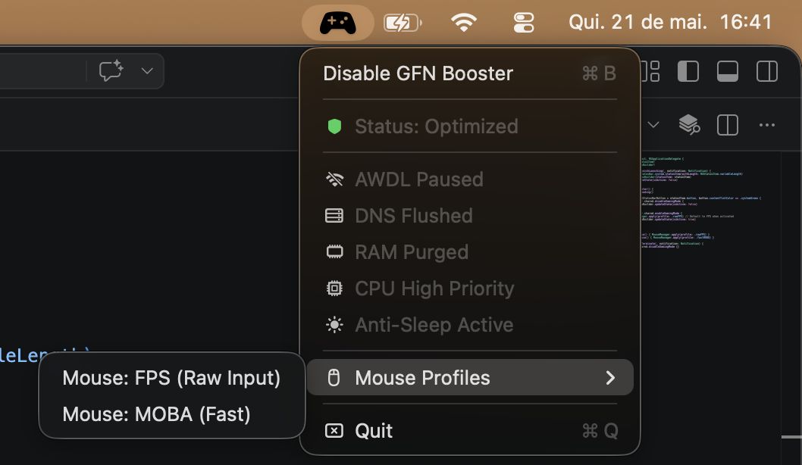

# GFN Booster (macOS)




## The Problem
Mac users relying on cloud gaming often experience random micro-stutters and sudden latency spikes, even on flawless fiber connections. In the Apple ecosystem, this is primarily caused by background routines like AWDL (AirDrop/Handoff), native mouse acceleration curves, and background CPU/RAM hoarding.

## How it Works (v1.1.0 Features)
As an open-source project running system-level commands, transparency is key. When you click **"Enable GFN Booster"**, the app asks for Administrator privileges **only once** to execute the following optimizations:

* **Clean Network:** Temporarily disables the AWDL interface (`ifconfig awdl0 down`).
* **Direct Routing:** Flushes and rebuilds the system's DNS cache (`dscacheutil -flushcache`).
* **RAM Purge:** Forces macOS to clear inactive unified memory cache, freeing up RAM for the game stream (`purge`).
* **Max CPU Priority:** Automatically detects the GeForce NOW process and injects a maximum `-20` nice level priority, preventing background apps from stealing CPU cycles.
* **Mouse Profiles:** Change mouse scaling on the fly between **FPS (Raw Input)** and **MOBA (Fast)** to bypass Apple's native acceleration curve.
* **Bandwidth Focus:** Pauses Time Machine backups during the session (`tmutil disable`).
* **Console Mode (Anti-Sleep):** Starts the native `caffeinate` background process to prevent the display from sleeping.

### Fail-Safe (Security)
Whenever you click **"Disable GFN Booster"** or simply **"Quit"** the app, it automatically reverts absolutely every change. It restores the default mouse speed, reactivates AirDrop/Handoff, enables Time Machine, and hands power management back to macOS.

## Installation

### Option 1: Download the App (Recommended)
1. Go to the [Releases](../../releases) page.
2. Download the latest `GFN_Booster_v1.1.0.dmg` file.
3. Open the `.dmg` and drag the app to your Applications folder.

> **⚠️ Important: "App is damaged" error**
> Since this app is open-source and isn't signed with a paid Apple Developer certificate, macOS Gatekeeper tags it with quarantine attributes when downloaded via a browser. If you get an error saying the app is damaged and should be moved to the Trash, simply open your **Terminal** and run this command to clear the quarantine flag:
> ```bash
> xattr -cr /Applications/"GFN Booster.app"
> ```
> After that, you can open the app normally!

### Option 2: Build from Source
To compile and run from the source code directly via terminal:

```bash
git clone [https://github.com/your-username/GFNOptimizer.git](https://github.com/your-username/GFNOptimizer.git)
cd GFNOptimizer
swift run
```


