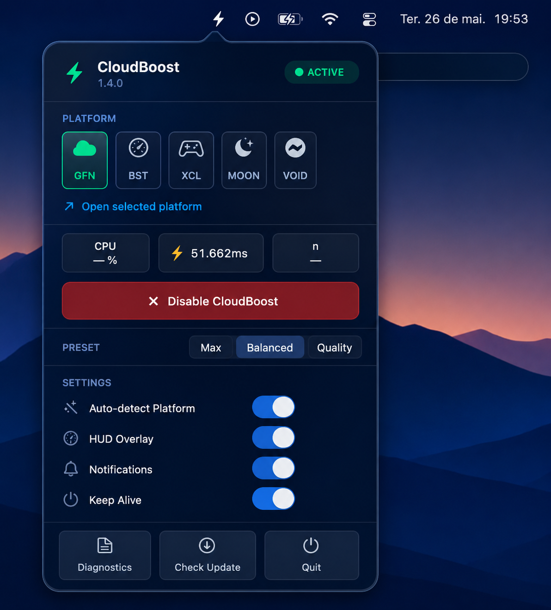
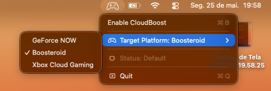

# CloudBoost ☁️🚀

<p align="left">
  
  
  
  
  
</p>

**CloudBoost** is a native, open-source macOS menu bar utility written in Swift. It optimizes your operating system in real-time to eliminate micro-stutters, ping spikes, and input lag during cloud gaming sessions.

Currently supports **GeForce NOW**, **Boosteroid**, and **Xbox Cloud Gaming (xCloud)** natively.

<br>

<p align="center">
  
  &nbsp;&nbsp;&nbsp;&nbsp;
  
</p>

<br>

---

## 🔍 How it works

macOS runs several background processes that compromise high-refresh-rate, low-latency video streams. When you enable CloudBoost, the app asks for Administrator privileges (just once per session) and automates the following tweaks:

* **Kills Ping Spikes (AWDL Off):** Temporarily disables the `awdl0` network interface (used for AirDrop and Handoff). This stops the constant background Wi-Fi scanning, which is the main culprit behind sudden ping drops.
* **Max CPU Priority (`renice`):** Identifies the process of your chosen platform (or your default browser for xCloud) and forces a maximum `-20` nice level priority, preventing background apps from stealing your CPU cycles and causing stream stutters.
* **Custom Mouse Profiles:** Lets you toggle between **FPS (Raw Input)** and **MOBA (Fast)** profiles directly from the menu bar, completely bypassing Apple's floaty native mouse acceleration curve.
* **RAM Purge & DNS Flush:** Flushes your DNS cache to ensure direct routing and forces a purge of inactive unified memory, freeing up physical RAM for the stream decoder.
* **Bandwidth & Power Focus:** Temporarily pauses Time Machine backups and triggers the native `caffeinate` command so your Mac doesn't throttle clock speeds or put the display to sleep mid-match.

**The Fail-Safe:** The moment you click "Disable CloudBoost" or quit the app, absolutely everything is instantly reverted to your system's default state.

---

## 💻 Compatibility

* **Universal Binary:** Compiled natively for both **Apple Silicon (M-Series)** and older **Intel Macs**. It runs on bare metal with zero Rosetta translation overhead.
* **Auto-Updater:** The app silently checks the GitHub API on startup and will prompt you natively when a new version is available.

---

## 📥 Installation

1. Go to the [Releases](https://github.com/victorbrandaao/CloudBoost/releases) tab and download the latest `.dmg` file.
2. Open the `.dmg` and drag **CloudBoost.app** to your `/Applications` folder.

> **⚠️ Important note on macOS Gatekeeper:**
> Because this is an unsigned open-source tool, macOS will likely throw an "App is damaged" error when you try to open it. To clear the quarantine flag, simply open your Terminal and run:
> ```bash
> xattr -cr /Applications/"CloudBoost.app"
> ```
