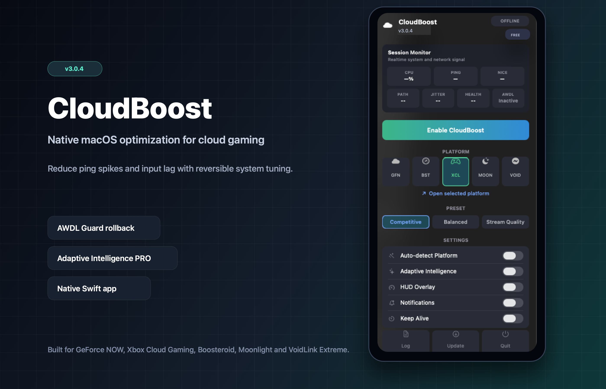

# CloudBoost

Native macOS optimization toolkit for cloud and Mac gaming.

CloudBoost is a lightweight menu bar app built in Swift to reduce micro-stutters, ping spikes, and input lag during cloud gaming and local Mac gaming sessions. It focuses on temporary, reversible system tuning instead of permanent background services or opaque cleaner-style behavior.

<p align="center">
  
  
  
  
  
</p>

<p align="center">
  
</p>

## Download

Visit the [CloudBoost website](https://victorbrandaao.github.io/CloudBoost/) or download the latest release directly from GitHub.

Download the latest release from the [Releases page](https://github.com/victorbrandaao/CloudBoost/releases).

For the CloudBoost 3.1.0 beta, download **CloudBoost_v3.1.0-beta.dmg**, open the disk image, and drag **CloudBoost.app** to `/Applications`.

> **Gatekeeper note:** Because CloudBoost is independently signed, macOS may show an "App is damaged" warning on first launch. To clear the quarantine flag, run:
>
> ```bash
> xattr -cr /Applications/"CloudBoost.app"
> ```

This repository is used for public releases, documentation, and downloadable binaries. CloudBoost is proprietary software and the source code is not publicly distributed.

## Supported Platforms

| Platform | Availability |
|---|---|
| GeForce NOW | Free |
| Xbox Cloud Gaming (xCloud) | Free |
| Boosteroid | PRO |
| Moonlight | PRO |
| VoidLink Extreme | PRO |
| Local Game | Free |
| Steam | PRO |
| Epic Games | PRO |
| Battle.net | PRO |

## What CloudBoost Does

macOS background services can interfere with latency-sensitive video streaming. When you enable CloudBoost, the app applies temporary optimizations for the selected session and restores the system when the session ends.

Current optimization areas include:

| Area | Purpose |
|---|---|
| AWDL control | Temporarily disables `awdl0` to reduce AirDrop/Handoff Wi-Fi scanning spikes |
| AWDL Guard | Restores `awdl0` automatically if CloudBoost stops unexpectedly |
| Process priority | Raises priority for the active streaming client with `renice` |
| DNS refresh | Clears stale local DNS cache during session startup |
| Power focus | Uses `caffeinate` to avoid sleep and session throttling |
| Time Machine control | Pauses backup activity in selected presets |
| Kernel-aware TCP tuning | Competitive mode can tune Darwin TCP delayed ACK and restore it later |
| Mouse profiles | Applies session mouse profiles for low-latency input |
| Local game detection | Detects common Mac game launchers and selected foreground games |
| Direct updater | Checks GitHub releases, downloads the DMG, and falls back to the release page |

All changes are designed to be temporary and reversible.

## CloudBoost PRO

CloudBoost PRO unlocks advanced automation and observability features:

| Feature | Free | PRO |
|---|---:|---:|
| GeForce NOW and xCloud support | Yes | Yes |
| Manual Boost | Yes | Yes |
| AWDL Guard rollback protection | Yes | Yes |
| Balanced preset | Yes | Yes |
| Local Game profile | Yes | Yes |
| Boosteroid, Moonlight, VoidLink Extreme | No | Yes |
| Steam, Epic Games, Battle.net profiles | No | Yes |
| Auto-Detect platform switching | No | Yes |
| Auto Boost | No | Yes |
| Competitive and Stream Quality presets | No | Yes |
| Keep Alive | No | Yes |
| Diagnostics export | No | Yes |
| Adaptive Intelligence | No | Yes |
| Stability Guard and Heat Guard | No | Yes |

Adaptive Intelligence monitors route type, latency, jitter, packet loss, thermal pressure, Low Power Mode, and common background interference to classify session health in real time.

To activate PRO, purchase a license on [Gumroad](https://victorbrandao0.gumroad.com/l/CloudBoost), then click any locked feature in CloudBoost and enter the license key.

## Features

- Native macOS menu bar app.
- Redesigned session monitor with CPU, ping, priority, network path, jitter, session health, trend, and AWDL Guard status.
- One-click enable/disable flow with automatic restore.
- Presets for Balanced, Competitive, and Stream Quality behavior.
- Floating HUD with live session statistics.
- Direct updater that downloads the latest DMG from GitHub releases and opens the installer.
- Local diagnostics and self-test tooling in development builds.

## Security And Transparency

CloudBoost does not collect personal data, install kernel extensions, permanently modify protected system files, or run hidden daemons. The app uses supported macOS command-line tools and native APIs, and session changes are designed to be restored when CloudBoost is disabled or quits.

CloudBoost may request administrator permission for specific system-level actions such as temporary network interface changes. These actions are session-based and are restored when the boost is disabled or when the app quits.

## Roadmap

- More platform-specific tuning profiles.
- Better browser-session detection.
- Expanded Adaptive Intelligence recommendations.
- Optional advanced diagnostics panel.
- More cloud gaming platform integrations.

## License

CloudBoost is proprietary software. No permission is granted to copy, modify,
distribute, or create derivative works from the code or app without prior
written authorization. See the [LICENSE](LICENSE) file for the full terms.
